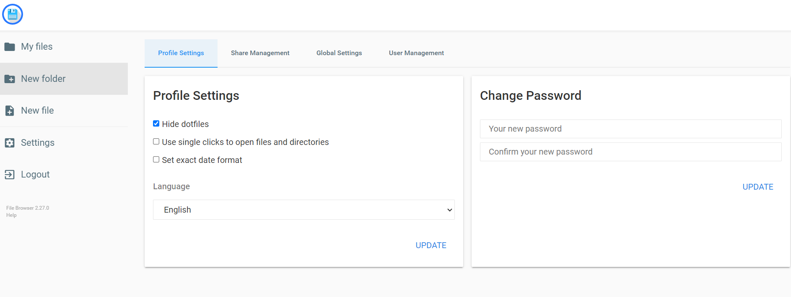
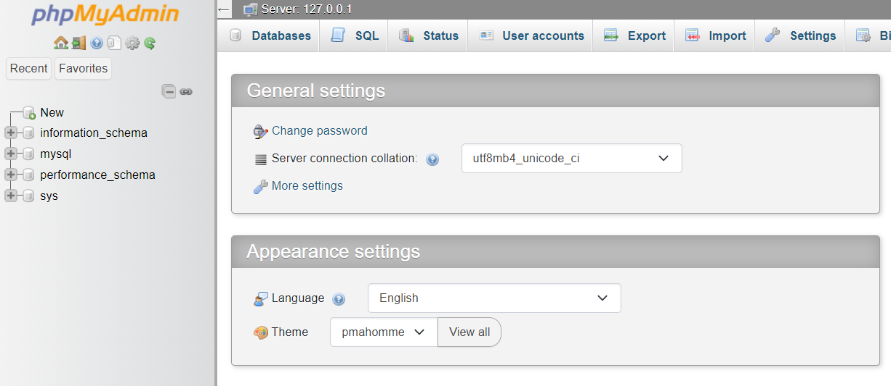
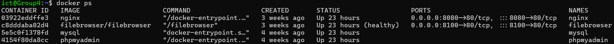

# Handleiding virtuele omgevingen
##### Webdeployment HBO-ICT jaar 1 2023-2024

## Inleiding.

Voor het project Webdeployment krijgt iedere groep een eigen virtuele linux omgeving (hierna genoemd server) waar de web applicatie die ontwikkeld wordt als docker container deployed kan worden. 
Deze omgeving is van buitenaf bereikbaar en bevat de volgende opties.

-	Een MySql server 
> intern bereikbaar op localhost:3306
-	Een webbased Filebrowser om files vanuit een webbrowser over te kunnen zetten naar de server
> group{x}-files.webdeployment.nl
-	Een webbased database administratie tool voor visuele administratie van de MySql server
> group{x}-database.webdeployment.nl
-  localhost:8080(intern andres van de webapplicaties straks) is te bereiken op
>group{x}.webdeployment.nl

\* {x} = je groupnummer

## Secure Shell

Om toegang te krijgen tot de CLI(command line interface) van de server gaan we een SSH(secure shell) connectie maken met de server.
Doorloop de volgende stappen om vanaf je pc of laptop een SSH connectie te kunnen maken.

##### WINDOWS

1. Start bij voorkeur Powershell. En anders command prompt(cmd.exe)
2. Installeer de cloudflare connector met het volgende commando in de terminal. Deze zorgt ervoor dat je de connectie van buitenaf met de server kan maken
```sh
winget install --id cloudflare.cloudflared
```

3. Ga naar de .shh directory met het volgende commando
```sh
cd .ssh
```

4. Voer het volgende commando uit om er zeker van te zijn dat de file genaamd 'config' bestaat
```sh
New-Item -f config
```

5. Voer het volgende commando uit om notepad te openen voor de config file 
```sh
notepad config
```

6. Vervang de inhoud van config file met het volgende, waarbij {x} je groepnummer is (bijvoorbeeld group12-terminal.webdeploy)
   Save de config file
```sh
Host group{x}-terminal.webdeployment.nl
ProxyCommand C:\Program Files (x86)\cloudflared\cloudflared.exe access ssh --hostname %h
```

7. Nu kan je een SSH connectie maken met de server met het volgende commando, waarbij {x} je groepnummer is
   - waarschijnlijk krijg je de melding dat de host nog niet bekend is en of je wil doorgaan met de aangegeven key fingerprint)
   - Type 'yes'
   - Het standaard wachtwoord van de server is: 12345
   
```sh
ssh ict@group{x}-terminal.webdeployment.nl
```

Nu zitten we in de zogenaamde shell van de linux server


6. Om er voor te zorgen dat niet iedereen toegang heeft tot jullie server, gaan we het wachtwoord veranderen. Met het volgende commando in de shell. Berg dit wachtwoord ergens veilig op!!!
```sh
passwd
```

#### MacOs
>Volgt

<br/>

## Filebrowser

Mocht het nodig zijn om files over te zetten naar de server dan kan dit via de webbased filebrowser.
Deze kan je bereiken op het volgende adres, waarbij {x} je groepnummer is.
```
https://group{x}-files.webdeployment.nl
```

De standaar login is:

Username: admin

Password: admin

Het wachtwoord kan je aanpassen in de webinterface bij settings.



## MySql Server en phpMyAdmin

Op de server is een docker container actief met daarin een MySql server. Deze server is bereikbaar via localhost of 127.0.0.1 op poort 3306 (standaard poort voor database connecties)

#### ConnectionString
Maak gebruik van de volgende connectie string om vanuit C# Blazor connectie te maken:

```csharp
"Server=localhost;port=3306;Database={database naam};Uid=root;Pwd=Test@1234!"
```

#### phpMyAdmin
Je kan de mySql server managen via een webbased adminstratietool genaamd phpMyAdmin.
Deze kan je bereiken op het volgende adres, waarbij {x} je groepnummer is
```
group{x}-database.webdeployment.nl
```

De standaard login voor mySql server is net zoals in periode 3:

Username: root

Password: Test@1234!

Je kan het wachtwoord veranderen door boven aan de pagina op Server: 127.0.0.1 te klikken en dan op change password:



## Standaard docker containers

Voer het volgende commando uit in de shell van de server om te zien welke docker containers momenteel actief zijn

```
docker ps
```



##### We zien hier 3 containers n.l:

- nginx: Een webserver op poort 8080 die je kan bereiken op onderstaand adres, waarbij {x} je groepsnummer is:
(deze staat hier tijdelijk zodat je kan zien dat je webapplicatie straks bereikbaar is op poort 8080)
```
group{x}.webdeployment.nl 
```
- filebrowser: De filebrowser applicatie
- mysql: de mySql Server
- phpmyadmin: Database administratie tool

# Belangrijke informatie

- Tussen 2:00 uur en 2:30 uur 's nachts wordt van elke omgeving een backup gemaakt. De server wordt dan een paar minuten in een soort stop staat gezet. Op dat moment is de server niet beschikbaar.
- Laat de containers die draaiden toen je voor het eerst inlogde met rust! Met uitzondering van de nginx container. Deze wordt ook vervangen door een container met jullie webapplicatie
- Mocht er onverhoopt iets verkeerd gaan stuur dan een mail naar. 

nick.burgmeijer@nhlstenden.com

Mogelijke problemen zijn:

    - wachtwoord vergeten, dan kan je een wachtwoord reset vragen
    - er is iets mis met de mysql, filebrowser of phpMyAdmin containers
    - je server is gecrashed
    - evt. andere problemen zoals een gecrashte docker daemon

Er is dan de mogelijkheid om eventeel een verse omgeving aan te vragen of een eerdere backup te herstellen (let op: de laatste 2 backups worden bewaard!)
