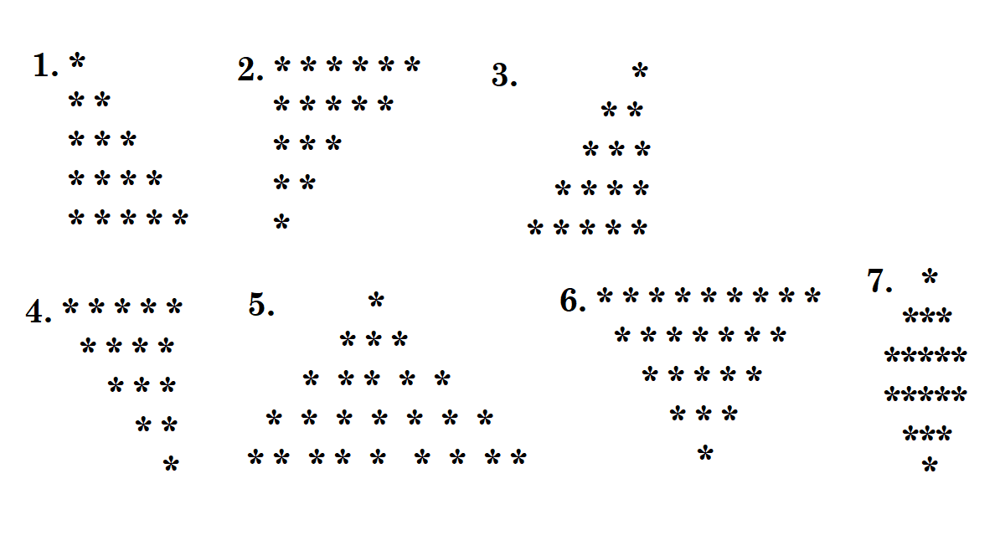

# Welkom

In dit project (BlazorCourse) vind je de opdrachten en voorbeelden met Blazor.
TOC:
- installatie
- onderwerpen per week/les
- opdrachten per week
- bronnen

Hier vind je de handleiding met betrekking tot the virtuele servers voor webdeployment:

https://github.com/jorislops/BlazorCourse/blob/main/Handleiding_virtuele_omgevingen.md


# Instalatie 

Met `git clone` kan je het project clonen.
Je zult dan wel de databases moeten aanmaken in MySQL of MariaDb. 
De SQL-code staat in `/SQL`. Voer deze code uit. 
De connection strings staan in `appsettings.json`.

Voer af en toe een git pull uit om de laatste versie te krijgen, mocht je dingen tegenkomen die niet kloppen 
of onduidelijk zijn schroom om te vragen zodat wij het kunnen verbeteren. Alvast bedankt.

# Onderwerpen per week/les

## Les 1 Razor Syntax & Voorbeeld & Structuur van Project
- Aanmaken van een Blazor project
  - @rendermode="new InteractiveServerRenderMode(prerender: !WebHostEnvironment.IsDevelopment())"
  - In app.razor
- Introductie van razor syntax (RazorSyntax.razor)
- Binding van data
- Events (Click)
- Simpel voorbeeld met todo
- Structuur van Blazor Project (hoog over)
  - Componenten idee
  - Pages
  - Hoe werkt Blazor Server

- Filmpjes van Frank Lui 

## Les 2 Componenten
- SPA-framework (zie filmpje van Frank Lui over SPA en componenten)
- Structuur van Blazor Project (nogmaals herhaling om te kijken of het is blijven hangen en omdat het belangrijk is ivm componenten)
  - Componenten idee
  - Pages
  - Hoe werkt Blazor Server (= InteractiveServerRenderMode)
- Components
  - Components as building blocks (lego)
  - Components as custom elements
  - Identifying components (screenshot)

State-management in components
- Components with Parameters
- Components & events
- Parent / child components
- Cascade Parameters

## Les 3 Verbinden met database 

- Dapper herhaling
- Simpele CRUD voorbeeld
- Navigatie tussen pages, Route Parameters, Query string parameters
- Repository Pattern gebruiken

## Les 4 Forms & Validatie & Routes & Layout
- EditForm
  - Validatie
  - Fluent Validation
- Generic Components
- RenderFragment 
- Using a component library Blazorise (https://blazorise.com/)
- Layouts

## Les 5 Advanced Subjects ** #Todo **

- Dependency Injection
- State Management (Service)
- Lifecycle methods (out of scope?)  
- RenderTreeBuilder (out of scope?)

## Les 6 Uitloop


# 1. Opdrachten les 1

Maak zelf een Blazor project aan.
Vergeet niet de RenderMode in te stellen voor het gehele project en Pre Rendering uit te zetten voor development.
Zet boven aan in 'App.razor' de volgende code:
``` @inject IWebHostEnvironment WebHostEnvironment```

In `App.razor` maak de volgende aanpassingen:
```html
  <Routes @rendermode="new InteractiveServerRenderMode(prerender: !WebHostEnvironment.IsDevelopment())"/>
```
```html
  <HeadOutlet @rendermode="new InteractiveServerRenderMode(prerender: !WebHostEnvironment.IsDevelopment())"/>
```
In Program.cs voeg het volgende: .AddInteractiveServerComponents() toe aan de services.
`builder.Services.AddRazorComponents()
    .AddInteractiveServerComponents();`

## 1.1 Razor Syntax
1. Maak een lijst aan van 10 random gehele getallen, waarbij je de even getallen groen maakt en de oneven getallen rood. De kleur kan je veranderen met `style` of een `css-class`. 
 Geef dit weer in een lijst (`<ul> <li>`).
1. Maak een pagina die een sterren piramide laat zien. Je mag 1 maken die jij leuk vindt. Je zou eventueel kunnen opgeven hoeveel lagen de pyramide moet hebben (gebruik hiervoor een <input type="number" .../> .
  

## 1.2 Binding van data
1. Maak een pagina aan die gegeven een getal (`<input type="number">`) de tafel van dat getal laat zien.
1. Een getal raden spelletje, waarbij je een getal moet raden tussen 1 en 100. Je geeft aan of het opgegeven getal te groot of 
   te klein is dan het te raden getal. Als de gebruiker het getal heeft geraden, dan wordt het aantal pogingen getoond en maak de pagina (of een div of iets dergelijks) groen.
1. Maak een pagina aan die een lijst van namen laat zien, je kan een naam toevoegen (`<input ...>`) of verwijderen (delete button). 
1. Er staan 5 knoppen op een pagina, als je op een knop klikt, dan wordt de naam (knop1, knop2, etc) van de knop getoond in een div.
1. Maak een pagina aan die een lijst van namen laat zien, er is een sorteer knop, als je op de knop klikt, dan worden de namen gesorteerd. 
   Als je nog een keer op de knop klikt, dan worden de namen in omgekeerde volgorde gesorteerd. Hint: OrderBy en OrderByDescending
1. In `Component/Pages/Todo/Todo.razor` staan de opdrachten voor het uitbreiden van de todo pagina. 
   Je zou dit project kunnen gebruiken om de opdrachten te maken. Het makkelijkste is dan om een `git clone` te doen.
 

# 2. Opdrachten les 2

## 2.1 Components
1. Maak een eigen counter component aan. Deze is verantwoordelijk voor het bijhouden van een getal. 
  Deze kan je verlagen met 1 of verhogen met 1. Test dit component op een page.
1. Maak nu een score bord pagina aan, deze bestaat uit twee counters (thuis team en uit team). 
  Het eerste team dat 11 punten haalt heeft gewonnen. De parent component (page) moet dan aangeven welk team heeft gewonnen. 
  Daarop verschijnt een knop om de counters te resetten.   
1. Maak een nieuwe pagina aan waarop een counter komt te staan. De stepsize bepaalt de verhoging/verlaging van de counter. 
  Dus b.v. een stepsize van 2, gaat de counter van 2 naar 4 of van 4 naar 2.
  De gebruiker van de pagina kan stepsize instellen in een `<input type="text" ....>`.
1. Maak een nieuwe pagina, met daarop twee counters. De eerste counter is voor de step size van de tweede counter. 
  De stepize bepaalt de omvang waarmee de counter zijn waarde aanpast.  
  Gebruik hierbij chained binding (`<MyCounterExercise @bind-Counter="_stepSize"/>`).
1. Maak het spel memory, waarbij je een aantal (b.v. 4x4) kaarten hebt en je moet als speler de kaarten bij elkaar zoeken die hetzelfde zijn.  
  Je zou b.v. eerst eens getallen kunnen gebruiken i.p.v. afbeeldingen, zodat je kan zien of het werkt.
  Elke kaart is een component, waarin wordt bijgehouden wat erop staat (getal) en of deze is omgedraaid of niet. 
  Als je een kaart omdraait, dan wordt de kaart getoond. Als je twee kaarten hebt omgedraaid, dan wordt gekeken of deze hetzelfde zijn. 
  Als dit zo is, dan blijven de kaarten omgedraaid, anders worden ze weer omgedraaid.
  Maak ook een component die bijhoudt hoeveel kaarten er zijn omgedraaid en hoeveel er goed zijn.
  Maak ook een component die de kaarten laat zien en waarbij je een nieuw spel kan starten.
  Maak ook een component aan die bijhoudt per speler hoeveel punten deze heeft (misschien hergebruik van eerder gemaakt component).

# 3 opdrachten - Les 3

## 3.1 Producten CRUD Pagina's

1. Maak een product tabel aan in de database, waarbij je de volgende kolommen hebt:
  - Id
  - Name
  - Price
  - CategoryId
2. Maak een category tabel aan in de database, waarbij je de volgende kolommen hebt:
  - Id
  - Name
3. Zorg ervoor dat je product en category koppelt m.b.v. een foreign key.
4. Gebruik Dapper voor interactie met de database. Tip: probeer 1 query te maken voor het ophalen van de data van zowel de product als category.
  Dit kan m.b.v. een JOIN-query. 
5. Je database code moet in een repository komen (ProductRepository en CategoryRepository)
6. Maak een pagina aan waarop de producten te zien zijn, waarbij je deze ook kan filteren op categorie. 
  Ieder product wordt weergeven in een component, waarbij je de naam, prijs en categorie laat zien.
7. Maak een pagina of component aan waarbij je een product kan toevoegen.
8. Maak een pagina of component aan die de details van een product laat zien, waarbij je ook het product kan verwijderen.

## 3.2 Todo aanpassen
1. In het BlazorCourse project `/Components/Pages/Databases/TodoExample/` staan `TodoListDb.razor` en gerelateerde componenten/pagina's en de repository.
1. De `TodoItem.cs` kan je vinden in 'Models/TodoItem.cs'. Deze wordt gebruikt door meeredere pagina's/componenten buiten de TodoExample directory. 
1. Kijk hoe de delete werkt in de repository (`TodoRepository.cs`), echter willen we ook de kinderen verwijderen, dit gebeurt nu met twee DELETE queries.
Pas dit aan zodat het met 1 DELETE query kan. Hiervoor moet je de foreign key constraint aanpassen (ON DELETE CASCADE).
1. Pas de componenten zo aan dat je een kind TodoItem (`public List<TodoItem> Items { get; set; } = new List<TodoItem>();`) kan toevoegen b.v. in <TodoDetails>.
1. Een TodoItem kan kinderen hebben, deze kinderen kunnen ook weer kinderen hebben. Kan jij `<TodoDetails>` en 
gerelateerde componenten zo aanpassen dat je onbeperkt diep kunt gaan en op ieder niveau kinderen kunt toevoegen/verwijderen.

## 3.3 Bier CRUD aanpassen
1. In het BlazorCourse project `/Components/Pages/Databases/BierExamle` staat de code van de bieren pagina's/componenten.
1. Om bieren toe te voegen, worden stijl en type niet in een aparte tabel opgeslagen, verander dit in de database. 
1. Maak dus twee nieuwe repositories aan voor stijl en type.
1. Maak ook twee nieuwe formulieren (pages) aan om stijl en type toe te voegen. (zie de `AddBier.razor` als inspiratie).
1. Maak ook twee pagina's aan die alle stijlen en types tonen.
1. Voeg de kolom voor biermerk toe in de tabel van `BierPage.razor`, voeg ook een kolom voor stijl en type toe. Zorg ervoor dat we hierop kunnen sorteren. 
1. Als je klikt op type, dan ga je naar de `BierPage.razor` die alle bieren van dat type laat zien. Hiervoor zul je een extra @page patroon (route template) moeten toevoegen (b.v. "/bier/stijl/LAGER,PALE").
1. Als je klikt op stijl, dan ga je naar de `BierPage.razor` die alle bieren van die stijl laat zien.  Gebruik hiervoor een query string (b.v. "/bier?type=WEIZE"). Ik krijg er al dorst van.
1. De huidige pagina moet geselecteerd zijn in de pager (de nummers/navigatie onder de tabel waarmee je naar andere records van bieren tabel kan navigeren).
1. Laat 5 pagina's voor/en na de huidige pagina zien ipv 10 pagina's in de pager.
1. Maak extra zoekfunctionaliteit zodat je kan zoeken op naam van de brouwer.
1. Maak extra `<select>`'s ([Uitleg select](https://www.w3schools.com/tags/tag_option.asp)) aan in de select voor stijl en type, zodat je kan zoeken op stijl en type.
1. In `BierDelete.razor` wordt de brouwer naam niet getoond, pas dit aan.
1. Maak een pagina aan die een bier kan wijzigen (edit). Haal je inspiratie uit de AddBier.razor. Als je echt je best doet kan dit in 1 pagina. 
  Echter misschien is het makkelijker om eerst een aparte pagina te maken te maken voor het wijzigen.

# 4 Opdrachten Les 4 

## 4.1 Forms & Validatie & Routes & Layout

1. Zorg ervoor dat er input validatie is op de producten pagina van Les 3 opdrachten. 
  Dit betekent dat een product niet toegevoegd kan worden als de naam leeg is of de prijs niet een getal is groter dan 1 euro.
1. Ook moet je de categorie selecteren, als deze niet is geselecteerd, dan kan je het product niet toevoegen.
1. Maak een pagina aan waarbij je een category kan selecteren en dat je daarna de producten van die category ziet.
1. Maak een pagina aan waarbij je de category kan toevoegen/verwijderen. Een category kan niet verwijderd worden als er 
  nog producten zijn die deze category hebben, je moet dan eerst de producten verwijderen.  Vraag aan de gebruiker of hij dit wil doen of niet.

## 4.2 Layout 

1. Maak een Layout aan voor je producten pagina, waarbij je een header en footer hebt. 
  - De header bevat een navigatie menu, waarbij je kan navigeren naar de producten pagina en de category pagina.
  - In de footer staat het aantal producten en categorieën die er zijn. 

## 4.3 Component Library (Blazorise)

1. In de echte wereld gebruiken we niet zelf ontwikkelde componenten maar die door andere zijn ontwikkeld. 
  Het handigste is om een nieuw project te beginnen. Vergeet
  niet de RenderMode in te stellen voor het gehele project en Pre Rendering uit te zetten voor development.
  Zet boven aan in 'App.razor' de volgende code:
  ```@inject IWebHostEnvironment WebHostEnvironment```
   In `App.razor` maak de volgende aanpassingen:
```razor
  <Routes @rendermode="new InteractiveServerRenderMode(prerender: !WebHostEnvironment.IsDevelopment())"/>
```
```
  <HeadOutlet @rendermode="new InteractiveServerRenderMode(prerender: !WebHostEnvironment.IsDevelopment())"/>
```
  In Program.cs voeg het volgende: .AddInteractiveServerComponents() toe aan de services.
  `builder.Services.AddRazorComponents()
  .AddInteractiveServerComponents();`

1. Op https://blazorise.com/ staat een knop getting started. Kijk eerst of je Blazorise aan de praat krijgt. 
1. In het BlazorCourse project staat `Components\BlazoriseDataGrid.razor`. Bekijk maar eens hoe dit werkt.
1. Op https://bootstrapdemo.blazorise.com/ staan demo's van de verschillende UI componenten bekijk deze maar eens.
1. Maak zelf een pagina met Blazorize componenten die product weergeeft in een tabel (m.b.v. DataGrid component).
1. Eventueel kan je ook een filter toevoegen, zodat je kan filteren op categorie (m.b.v. een dropdown).
  M.b.v. een componenten bibliotheek kan je meer focussen op de functionaliteit van je applicatie en minder 
  op de layout/ui-componenten. 
  

# Les 5 opdrachten - Advanced Subjects

1. Maak een service aan die verantwoordelijk is het manager van de state van het memory spel (les 2 laatste opdracht).  
  Register Callbacks in deze services zodat componenten weten dat ze moeten updaten.

# Bronnen
## Aanbevolen bronnen
- [Blazor Video van Frank Liu](https://www.youtube.com/c/FrankLiuSoftware)


- [awesome-blazor 1](https://github.com/AdrienTorris/awesome-blazor)
- [Blazor in Action - Book](https://learning.oreilly.com/library/view/blazor-in-action/9781617298646/)
- [Blazor Train - Video's concept oriented](https://blazortrain.com/)
- [mastering-state-management-in-blazor-a-comprehensive-guide] (https://kaushikroychowdhury.com/blog/mastering-state-management-in-blazor-a-comprehensive-guide/)
## Blazor state management
  - [State management in Blazor - Don Wibier - NDC Porto 2022] (https://www.youtube.com/watch?v=L9p-9dGp-98)
  - [Blazor state management with Fluxor] (https://www.youtube.com/watch?v=yM9F8rxo8L8)
